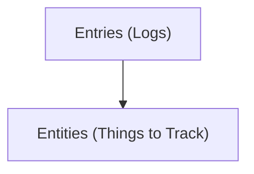

# Key Concepts
## Entity

**Type:** Core Concept – specialized for tracking items (`Habit`, `Task`, `Expense`, `Mood`)
**Purpose:**  
Represents a trackable item; defines a structured schema for logging entries and supporting analysis.

### State (Formal Definition)

Let an Entity $E$ be a tuple:
$$
E = (n, t, u, T, f, C)
$$
Where:  
- $n \in \text{String}$ : name of the entity (unique per user)  
- $t \in \{\text{Habit}, \text{Task}, \text{Expense}, \text{Mood}\}$ : type of entity  
- $u \in \text{Unit}$ : measurement unit (e.g., hours, dollars, rating)  
- $T \in \mathbb{R} \cup \text{String}$ : target value or goal  
- $f \in \text{Frequency}$ : frequency of tracking (e.g., daily, weekly)  
- $C \subseteq \text{Category}$ : tags or categories for classification  

### Actions (Formal Notation)

1. **Create Entity**  
$$
createEntity(u, t, n, T, f, C) \rightarrow E
$$
Adds a new Entity $E$ to the system if constraints are satisfied.
2. **Update Entity**  
$$
updateEntity(E, \Delta E) \rightarrow E'
$$
Modifies the state of existing entity $E$ with changes $\Delta E$ to produce updated entity $E'$.
3. **Delete Entity**  
$$
deleteEntity(E) \rightarrow \emptyset
$$
Removes entity $E$ from the system.

### Operational Principle (Mathematical Model of Behavior)

- **Standardization:** Every entity $E$ provides a consistent schema so that entries  
  $X_E = \{x_1, x_2, ..., x_n\}$ can be recorded uniformly.
- **Analysis:** For all entries $x_i \in X_E$, statistical or goal-based analysis can be applied:  
$$
analyze(E) = f(X_E, T, f)
$$
- **Consistency Constraint:**  
$$
\forall E_i, E_j: (E_i.n = E_j.n \implies E_i.user \neq E_j.user)
$$
Ensures unique entity names per user.
- **Behavioral Invariant:**  
Entries can be consistently aggregated, compared, and analyzed over time, enabling goal-tracking, habit formation, and performance evaluation.

### Constraints / Invariants

- $n$ unique per user  
- $t, u, f$ must be defined ($t \neq \emptyset$, $u \neq \emptyset$, $f \neq \emptyset$)  
- $T$ must be consistent with type $t$:  
$$
t = \text{Habit} \implies T \in \mathbb{R} \cup \{\text{True, False}\}  
$$
$$
t = \text{Task} \implies T \in \{\text{Complete}, \text{Incomplete}\}  
$$

## Entry

**Type:** Core Concept – a single logged instance of an Entity
**Purpose:**  
An Entry captures a specific measurement, observation, or event for an Entity at a given point in time. It allows tracking progress, analyzing trends, and deriving actionable insights.

### State (Mathematical Model)

We define an Entry $X$ as a tuple:
$$
X = (E_{\text{id}}, v, t_s, N)
$$
Where:  
- $E_{\text{id}}$ is the identifier of the parent Entity $E$  
- $v$ is the recorded value of the Entry (must conform to the Entity type)  
- $t_s$ is the timestamp when the Entry was logged  
- $N$ is optional notes or contextual information associated with the Entry  

### Actions (Formal Notation)

1. **Create Entry**  
$$
createEntry(E_{\text{id}}, v, t_s, N) \rightarrow X
$$
Adds a new Entry $X$ linked to the parent Entity $E$ if constraints are satisfied.
2. **Update Entry**  
$$
updateEntry(X, \Delta X) \rightarrow X'
$$
Modifies the state of an existing Entry $X$ with changes $\Delta X$ to produce an updated Entry $X'$.
3. **Delete Entry**  
$$
deleteEntry(X) \rightarrow \emptyset
$$
Removes Entry $X$ from the system.

### Operational Principle (Mathematical Model of Behavior)

- **Chronological Logging:** Entries $X_E = \{x_1, x_2, ..., x_n\}$ are recorded in time order to track changes and trends for a given Entity $E$.  
- **Analysis:** Data from Entries can be aggregated or analyzed over time:  
$$
analyze(E) = f(\{X_E\}, T, f)
$$
- **Consistency Constraint:** Each Entry must reference a valid Entity and conform to its type:  
$$
\forall X \in \text{Entries}: X.E_{\text{id}} \in \text{Entities} \quad \text{and} \quad value(X) \sim type(E)
$$
- **Behavioral Invariant:** Structured, chronological Entries allow visualization of progress, streak tracking, and informed decision-making.

### Constraints / Invariants

- $E_{\text{id}}$ must reference an existing Entity  
- $t_s$ must be defined (timestamp cannot be empty)  
- $v$ must conform to the type and unit of the parent Entity  
- Optional notes $N$ can store additional context but do not affect validation

# Concept Dependency Diagram

